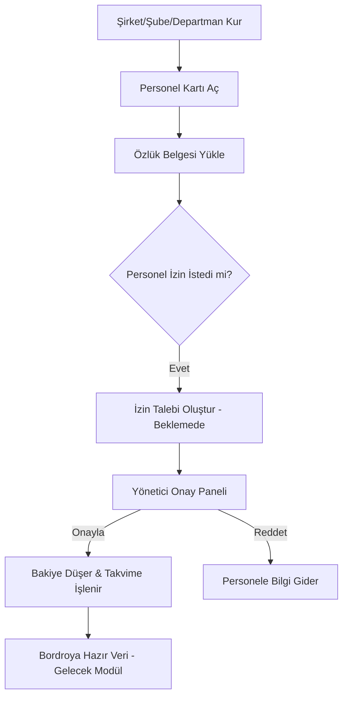

# 🗺️ IRONHR Uygulama Kullanım Senaryosu & İş Akış Rehberi

Bu dosya, **IRONHR** sisteminin uçtan uca nasıl kullanılacağını, hangi adımın hangi iş sonucuna bağlandığını anlatan canlı bir dokümandır. Yeni modüller eklendikçe Numan Bey (Alan Uzmanı) tarafından güncellenecektir.

---

## 🛠️ 1. Aşama: Organizasyonel Temel (Setup)

_Amacı: Kurumun hiyerarşik iskeletini oluşturmak._

1.  **Şirket Tanımı:** `Şirket` menüsünden ana holding veya firma bilgileri girilir (Vergi no, Adres vb.).
2.  **Şube Yapısı:** Şirkete bağlı fiziksel lokasyonlar (Merkez, Fabrika, Depo vb.) eklenir.
3.  **Departman Kurulumu:** Şubelerin altındaki fonksiyonel birimler (İK, Bilgi İşlem, Satış) tanımlanır.

---

## 👤 2. Aşama: Personel Özlük Yönetimi (Onboarding)

_Amacı: Çalışan verisini dijital dünyaya hatasız aktarmak._

1.  **Personel Kaydı:** `Yeni Personel` formundan giriş yapılır.
2.  **Organizasyonel Atama:** Personel mutlaka bir Şube ve Departman ile eşleştirilir.
3.  **Kritik Veri Girişi:** T.C. Kimlik No ve İşe Giriş tarihi girilir. Bu aşamada Mete Bey'in doğrulama algoritmaları devreye girer.

---

## 📂 3. Aşama: Dijital Arşiv & Belge Yönetimi

_Amacı: Fiziksel kağıt trafiğini sonlandırmak._

1.  **Belge Yükleme:** Personel detay sayfasındaki "Dosyalar" sekmesinden Kimlik, Diploma, İkametgah gibi evraklar sisteme yüklenir.
2.  **Görsel Takip:** Mebrure Hanım'ın tasarımıyla belgeler kartlar halinde, tıklandığında önizlenebilir şekilde listelenir.

---

## 🌴 4. Aşama: İzin ve Zaman Yönetimi

_Amacı: Personel izin haklarını yasal zeminde takip etmek._

1.  **Bakiye Sorgulama:** Personel detay sayfasında sistem, kıdem bazlı kalan izin gününü otomatik hesaplar.
2.  **Talep Oluşturma:** Personel `İzin Talebi Oluştur` butonuyla tarihlerini girer.
3.  **Statü Takibi:** Talep başlangıçta "Beklemede" (Pending) durumundadır.

---

## 👔 5. Aşama: Yönetici Onay Merkezi

_Amacı: Operasyonel planlama ve onay trafiğini yönetmek._

1.  **Onay Paneli:** `İzin Onayları` sekmesinden tüm bekleyen talepler listelenir.
2.  **Karar Verme:** Yönetici talebi `Onayla` veya `Reddet` seçenekleriyle sonuçlandırır.
3.  **Otomatik Güncelleme:** Onay verildiği an personelin bakiyesi otomatik düşer ve veriler takvime işlenir.

---

## 📅 6. Aşama: Görsel Takip (Takvim)

_Amacı: Şirket genelindeki müsaitlik durumunu izlemek._

1.  **Takvim Görünümü:** `İzin Takvimi` üzerinden hangi personele ne zaman izin verildiği, aylık view üzerinden izlenir.
2.  **Renk Kodları:** Onaylı izinler (Yeşil) ve Bekleyen talepler (Sarı) ayırt edilebilir.

---

## 📊 Süreç Akış Şeması (Mermaid)

---

_Son Güncelleme: 28 Ocak 2026_
_Hazırlayan: Numan Bey (HR Alan Uzmanı)_
